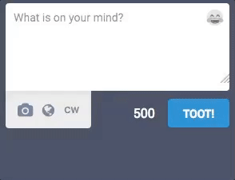
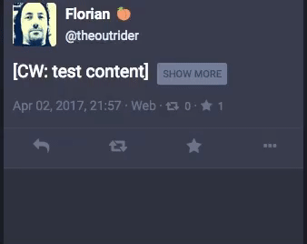
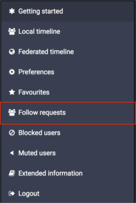
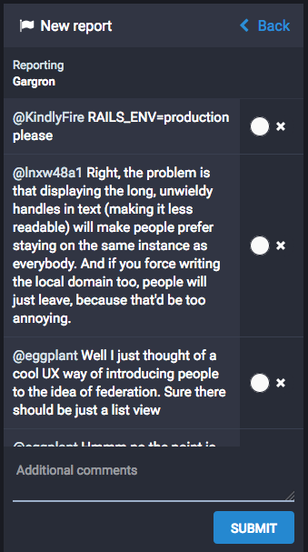

Mastodon User's Guide
=====================

* [Intro](User-guide.md#intro)
  * [Decentralization and Federation](User-guide.md#decentralization-and-federation)
* [Getting Started](User-guide.md#getting-started)
  * [Setting Up Your Profile](User-guide.md#setting-up-your-profile)
  * [E-Mail Notifications](User-guide.md#e-mail-notifications)
  * [Text Posts](User-guide.md#text-posts)
    * [Content Warnings](User-guide.md#content-warnings)
    * [Hashtags](User-guide.md#hashtags)
    * [Boosts and Favourites](User-guide.md#boosts-and-favourites)
  * [Posting Images](User-guide.md#posting-images)
  * [Following Other Users](User-guide.md#following-other-users)
  * [Notifications](User-guide.md#notifications)
  * [Mobile Apps](User-guide.md#mobile-apps)
  * [The Federated Timeline](User-guide.md#the-federated-timeline)
  * [The Local Timeline](User-guide.md#the-local-timeline)
  * [Searching](User-guide.md#searching)
* [Privacy, Safety and Security](User-guide.md#privacy-safety-and-security)
  * [Two-Factor Authentication](User-guide.md#two-factor-authentication)
  * [Account Privacy](User-guide.md#account-privacy)
  * [Toot Privacy](User-guide.md#toot-privacy)
  * [Blocking](User-guide.md#blocking)
  * [Reporting Toots or Users](User-guide.md#reporting-toots-or-users)

## Intro

Mastodon is a social network application based on the OStatus protocol. It behaves a lot like other social networks, especially Twitter, with one key difference - it is open-source and anyone can start their own server (also called an "*instance*"), and users of any instance can interact freely with those of other instances (called "*federation*"). Thus, it is possible for small communities to set up their own servers to use amongst themselves while also allowing interaction with other communities.

#### Decentralization and Federation

Mastodon is a system decentralized through a concept called "*federation*" - rather than depending on a single person or organization to run its infrastructure, anyone can download and run the software and run their own server. Federation means different Mastodon servers can interact with each other seamlessly, similar to e.g. e-mail.

As such, anyone can download Mastodon and e.g. run it for a small community of people, but any user registered on that instance can follow, send, and read posts from other Mastodon instances (as well as servers running other OStatus-compatible services, such as GNU Social and postActiv). This means that not only is users' data not inherently owned by a company with an interest in selling it to advertisers, but also that if any given server shuts down its users can set up a new one or migrate to another instance, rather than the entire service being lost.

Within each Mastodon instance, usernames just appear as `@username`, similar to other services such as Twitter. Users from other instances appear, and can be searched for and followed, as `@user@servername.ext` - so e.g. `@gargron` on the `mastodon.social` instance can be followed from other instances as `@gargron@mastodon.social`).

Posts from users on external instances are "*federated*" into the local one, i.e. if `user1@mastodon1` follows `user2@gnusocial2`, any posts `user2@gnusocial2` makes appear in both `user1@mastodon1`'s Home feed and the public timeline on the `mastodon1` server. Mastodon server administrators have some control over this and can exclude users' posts from appearing on the public timeline; post privacy settings from users on Mastodon instances also affect this, see below in the [Toot Privacy](User-guide.md#toot-privacy) section.

## Getting Started

#### Setting Up Your Profile

You can customise your Mastodon profile in a number of ways - you can set a custom "display" name, a profile "avatar" picture, a background image for your profile page header, and a short "bio" that summarises you or your account.

 To edit your profile, click the Preferences icon in the Compose column and select "Edit Profile" on the left-hand menu on the Preferences page. Your display name is limited to 30 characters, your bio to 160. Avatars and header pictures can be uploaded as png, gif or jpg images and cannot be larger than 2MB. They will be resized to standard sizes - 120x120 pixels for avatars, 700x335 pixels for header pictures. 

#### E-Mail Notifications

 Mastodon can notify you of activity via e-mail if you so choose. To adjust your settings for receiving e-mail notifications, click the Preferences icon in the Compose column and select the "Preferences" page from the left-hand menu. Here you will find a number of checkboxes to enable or disable e-mail notifications for various types of activity.

#### Text Posts

The most basic way to interact with Mastodon is to make a text post, also called a *Toot*. In order to toot, simply enter the message you want to post into the "What is on your mind?" text box in the Compose column and click "TOOT". There is a limit of up to 500 characters per toot; if you really do need more than this you can reply to your own toots so they will appear like a conversation.

If you want to reply to another user's toot, you can click the "Reply" icon on it. This will add their username to your input box along with a preview of the message you're replying to, and the user will receive a notification of your response.

Similarly, in order to start a conversation with another user, just mention their user name in your toot. When you type the @ symbol followed directly (without a space) by any character in a message, Mastodon will automatically start suggesting users that match the username you're typing. Like with replies, mentioning a user like this will send them a notification. If the post starts with a mention, it will be treated as a reply and will only appear in the Home timelines of users who follow both you and the user you are mentioning. It will still be visible on your profile depending on privacy settings.

##### Content Warnings

When you want to post something that you don't want to be immediately visible - for example, spoilers for that film that's just come out, or some personal thoughts that mention potentially upsetting topics, you can "hide" it behind a Content Warning.

To do this, click the  "CW" switch under the Compose box. This will add another text box labeled "Content warning"; you should enter a short summary of what the "body" of your post contains here while your actual post goes into the "What is on your mind?" box as normal.

This will cause the body of your post to be hidden behind a "Show More" button in the timeline, with only the content warning and any mentioned users visible by default:

**NOTE** that this will not hide images included in your post - images can be marked as "sensitive" separately to hide them from view until clicked on. To find out how to do this, see the [Posting Images](User-guide.md#posting-images) section of this user guide.

##### Hashtags

If you're making a post belonging to a wider subject, it might be worth adding a "hashtag" to it. This can be done simply by writing in the post a # sign followed by a phrase, e.g. #introductions (which is popular on mastodon.social for new users to introduce themselves to the community), or #politics for political discussions, etc. Clicking on a hashtag in a toot will show a timeline consisting only of public posts that include this hashtag (i.e. it's a shortcut to searching for it). This allows users to group messages of similar subjects together, forming a separate "timeline" for people interested in that subject. Hashtags can also be searched for from the search bar above the compose box.

##### Boosts and Favourites

You can *favourite* another user's toot by clicking the star icon underneath. This will send the user a notification that you have marked their post as a favourite; the meaning of this varies widely by context from a general "I'm listening" to signalling agreement or offering support for the ideas expressed.

Additionally you can *boost* toots by clicking the "circular arrows" icon. Boosting a toot will show it on your profile timeline and make it appear to all your followers, even if they aren't following the user who made the original post. This is helpful if someone posts a message you think others should see, as it increases the message's reach while keeping the author information intact. 

#### Posting Images

 In order to post an image, simply click or tap the "image" icon in your Compose column and select a file to upload.

If the image is "not safe for work" or has otherwise sensitive content, you can select the  "NSFW" button which appears once you have added an image. This will hide the image in your post by default, making it clickable to show the preview. This is the "visual" version of [content warnings](User-guide.md#content-warnings) and could be combined with them if there is text to accompany the image - otherwise it's fine to just mark the image as sensitive and make the body of your post the content warning.

You can also attach video files or GIF animations to Toots. However, there is a 4MB file size limit for these files and videos must be in .webm or .mp4 format.

#### Following Other Users

Following another user will make all of their toots as well as other users' toots which they [boost](User-guide.md#boosts-and-favourites) appear in your Home column. This gives you a separate timeline from the [public timelines](User-guide.md#the-public-timelines) in which you can read what particular people are up to without the noise of general conversation.

 In order to follow a user, click their name or avatar to open their profile, then click the Follow icon in the top left of their profile view.

If their account has a padlock icon  next to their user name, they will receive a notification of your request to follow them and they will need to approve this before you are added to their follower list (and thus see their toots). To show you that you are waiting for someone to approve your follow request, the Follow icon  on their profile will be replaced with an hourglass icon . The requirement for new followers to be approved is something you can enable for your own profile under preferences.

Once you follow a user, the Follow icon will be highlighted in blue on their profile ; you can unfollow them again by clicking this.

If you know someone's user name you can also open their profile for following by entering it in the [Search box](User-guide.md#searching) in the Compose column. This also works for remote users, though depending on whether they are known to your home instance you might have to enter their full name including the domain (e.g. `gargron@mastodon.social`) into the search box before their profile will appear in the suggestions.

Alternately, if you already have a user's profile open in a separate browser tab, most OStatus-related networks should have a "Follow" or "Subscribe" button on their profile page. This will ask you to enter the full user name to follow **from** (ie. if your account is on mastodon.social you would want to enter this as `myaccount@mastodon.social`)

#### Notifications

When someone follows your account or requests to follow you, mentions your user name, or boosts or favourites one of your toots, you will receive a notification for this. These will appear as desktop notifications on your computer (if your web browser supports this and you've enabled them) as well as in your "Notifications" column.

 You can filter what kind of notifications you see in the Notifications column by clicking the Notification Settings icon at the top of the column and ticking or un-ticking what you do or don't want to see notifications for.

 If your notifications become cluttered, you can clear the column by clicking the Clear icon at the top of the column; this will wipe its contents.

 You can also disable notifications from people you don't follow or who don't follow you entirely - to do this, click the Preferences icon in the Compose column, select "Preferences" on the left-hand menu and check either of the respective "Block notifications" options.

#### Mobile Apps

Mastodon has an open API, so anyone can develop a client or app to use Mastodon from anything. Many people have already developed mobile apps for iOS and Android. You can find a list of these [here](Apps.md). Many of these projects are also open source and welcome collaborators.

#### The Public Timelines

In addition to your Home timeline, there are two public timelines available. The Federated Timeline and the Local Timeline. These are both a good way to meet new people to follow or interact with.

##### The Federated Timeline

The Federated Timeline shows all public posts from all users "known" to your instance. This means the user is either on the same instance as you, or somebody on your instance follows that user. The Federated Timeline is a great way to engage in the broad chatter of the world. Following users on remote instances who you meet on the Federated Timeline can lead to meeting more users on more instances and further connecting your instance to more and more of the entire Mastodon and OStatus network.

 To view the federated timeline, click the "Federated Timeline" icon in your Compose column or the respective button on the Getting Started panel. To hide the federated timeline again, simply click the "Back" link at the top of the column while you're viewing it.

#### The Local Timeline

The Local Timeline only shows public posts made by users on your home instance. This can be useful if your instance has particular community norms that users on other instances may not have, such as particular topics that get put under content warnings; or particular in-jokes and shared interests. To view the Local Timeline, click the  Menu icon on the Compose pane and then select "Local Timeline" on the rightmost column.

#### Searching

Mastodon has a search function - you can use it to search for users and [hashtags](User-guide.md#hashtags). The search does not look through the entire text of posts, only hashtags. In order to start a search, just type into the search box in the Compose column and hit *enter*; This will open the search pane. The search pane will show suggestions as you type. Selecting any of these will open the user's profile or a view of all toots on the hashtag.

## Privacy, Safety and Security

Mastodon has a number of advanced security, privacy and safety features over more public networks such as Twitter. Particularly the privacy controls are fairly granular; this section will explain how these features work.

#### Two-Factor Authentication

Two-Factor Authentication (2FA) is a mechanism that improves the security of your Mastodon account by requiring a numeric code from another device (most commonly mobile phones) linked to your Mastodon account when you log in - this means that even if someone gets hold of both your e-mail address and your password, they cannot take over your Mastodon account as they would need a physical device you own to log in.

Mastodon's 2FA uses Google Authenticator (or compatible apps, such as Authy). You can install this for free to your [Android](https://play.google.com/store/apps/details?id=com.google.android.apps.authenticator2) or [iOS](https://itunes.apple.com/gb/app/google-authenticator/id388497605) device; [this Wikipedia page](https://en.wikipedia.org/wiki/Google_Authenticator#Implementations) lists further versions of the app for other systems.

 In order to enable 2FA for your Mastodon account, click the Preferences icon in the Compose column, click "Two-factor Authentication" in the left menu on the settings page and follow the instructions. Once activated, every time you log in you will need a one-time code generated by the Authenticator app on the device you've linked to your account.

#### Account Privacy

To allow you more control over who can see your toots, Mastodon supports "private" or "locked" accounts. If your account is set to private, you will be notified every time someone tries to follow you, and you will be able to allow or deny the follow request. Additionally, if your account is private, any new toots you compose will default to being private (see the [Toot Privacy](User-guide.md#toot-privacy) section below).

 To make your account private, click the Preferences icon in the Compose pane, select "Edit Profile" and tick the "Make account private" checkbox, then click "Save Changes".

You can then see follow requests in the Getting started menu

and approve or reject the individual requests

#### Toot Privacy

Toot privacy is handled independently of account privacy, and individually for each toot. The four tiers of visibility for toots are Public (default), Unlisted, Private, and Direct. In order to select your privacy level, click the  globe icon. Changes to this setting are remembered between posts, i.e. if you make one private toot, each toot you make will be private until you change it back to public. You can change your default post privacy under preferences.

**Public** is the default status of toots on most accounts. Public toots are visible to any other user on the public timelines, federate to other Mastodon and OStatus instances without restriction, and appear on your user profile page to anyone including search engine bots and visitors who aren't logged into a Mastodon account.

**Unlisted** toots are public, except that they do not appear in the public timelines or search results. They are visible to anyone following you and appear on your profile page to the public even without a Mastodon login. Other than not appearing in the public timelines or search results, they function identically to public posts.

**Private** toots do not appear in the public timeline nor on your profile page to anyone viewing it unless they are on your Followers list. The option is of limited use if your account is not also set to require approval of new followers (as anyone can follow you without confirmation and thus see your private toots). However the separation of this means that if you *do* set your entire account to private, you can switch this option off on a toot to make unlisted or even public toots from your otherwise private account.

Private toots cannot be boosted. If someone you follow makes a private toot, it will appear in your timeline with a padlock icon in place of the Boost icon. **NOTE** that remote instances may not respect this.

Private toots do not federate to other instances, unless you @mention a remote user. In this case, they will federate to their instance, and users on that instance who follow both you and the @mentioned user will see it in their Home timelines. There is no reliable way to check if an instance will actually respect post privacy. Non-Mastodon servers, such as a GNU Social server, do not support Mastodon privacy settings. A user on GNU Social who you @mention in a private post would not even be aware that the post is intended to be private and would be able to boost it, which would undo the privacy setting. There is also no way to guarantee that someone could not just modify the code on their particular Mastodon instance to not respect private post restrictions. A warning will be displayed if you're composing a private toot that will federate to another instance. You should thus think through how much you trust the user you are @mentioning and the instance they are on.

Private posts are not encrypted. Make sure you trust your instance admin not to just read your private posts on the back-end. Do not say anything you would not want potentially intercepted. 

**Direct** posts are only visible to users you have @mentioned in them and cannot be boosted. Like with private posts, you should be mindful that the remote instance may not respect this protocol. If you are discussing a sensitive matter you should move the conversation off of Mastodon. 

To summarise:

Toot Privacy | Visible on Profile | Visible on Public Timeline | Federates to other instances
------------ | ------------------ | -------------------------- | ---------------------------
Public | Anyone incl. anonymous viewers | Yes | Yes
Unlisted | Anyone incl. anonymous viewers | No | Yes
Private | Followers only | No | Only remote @mentions
Direct | No | No | Only remote @mentions

#### Blocking

You can block a user to stop them contacting you. To do this, you can click or tap the Menu icon on either a toot of theirs or their profile view and select "Block".

**NOTE** that this will stop them from seeing your public toots while they are logged in, but they *will* be able to see your public toots by simply opening your profile in another browser that isn't logged into Mastodon (or logged into a different account that you have not blocked).

Mentions, favourites, boosts or any other interaction with you from a blocked user will be hidden from your view. You will not see replies to a blocked person, even if the reply mentions you, nor will you see their toots if someone boosts them.

The blocked user will not be notified of your blocking them. They will be removed from your followers.

#### Muting

If you do not wish to see posts from a particular user, but do not care about if they see your posts, you may choose to *mute* them. You can mute a user from the same menu on their profile page that you would block them from. You will not see posts from a muted user unless they @mention you. A muted user will have no way to know that you have them muted. 

#### Reporting Toots or Users

If you encounter a toot or a user that is breaking the rules of your instance or that you otherwise want to draw the instance administrators' attention to (e.g. if someone is harassing another user, spamming pornography or posting illegal content), you can click the "..." menu button on the toot or the "hamburger" menu on the profile and select to report this. The rightmost column will then switch over to the following form:

In this form, you can select any toots you would like to report to the instance administrators and fill in any comment that might be helpful in identifying or handling the issue (from "is a spammer" to "this post contains untagged pornography"). The report will be visible to server administrators once it is sent so they can take appropriate action, for example hiding the user's posts from the public timeline or banning their account.
